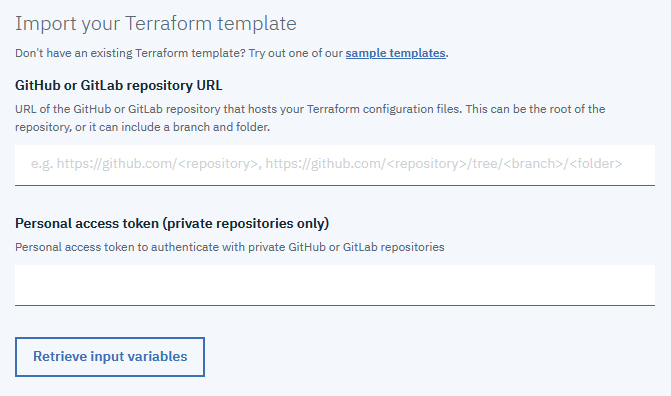
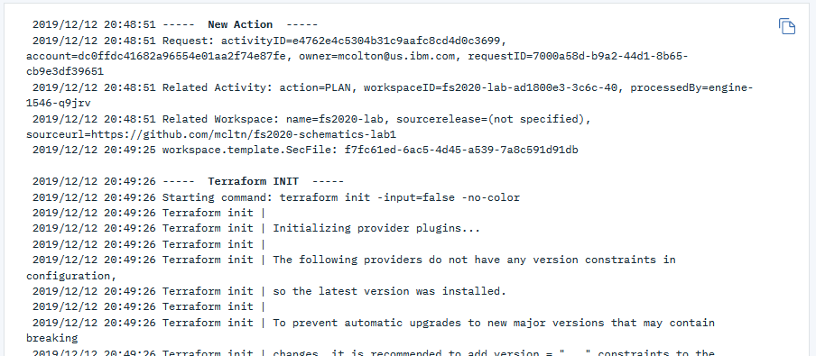

# FS 2020 Schematics Lab
## Introduction

This lab will introduce you to the concepts within Schematics and how to create a VPC, setup two subnets, and place a virtual instance in each as well as deploy a load balancer attached to the servers. A simple cloud-init script will install nginx, just to showcase an http response for proving out the example.

## Prerequisites

1. You must have an IBM Cloud account. You can sign up for a trial account if you do not have an account. The account will require the IBMid. If you do not have an IBMid, register and one will be created.

2. You will need to have a Infrastructure Username and API Key as well as a IBM Cloud API Key.

3. Check to make certain you have the appropriate role access on your account to provision infrastructure. If you are assigned an IBM Cloud Schematics service access role, you can view, create, update, or delete workspaces in IBM Cloud Schematics. To provision the IBM Cloud resources that you defined in your Terraform template, you must be assigned the IAM platform or service access role that is required to provision the individual resource. Refer to the [documentation](https://cloud.ibm.com/docs/home/alldocs) for your resource to determine the access policies that you need to provision and work with your resource. To successfully provision IBM Cloud resources, users must have access to a paid IBM Cloud account. Charges incur when you create the resources in the IBM Cloud account, which is initiated by clicking the Apply plan button. [Schematics Access](https://cloud.ibm.com/docs/schematics?topic=schematics-access)

4. In this lab we will be using the following resources. Double-check your access prior to applying the plan.
- VPC
- VSI

5. If you want to modify the variables for Image and Compute Profile, you will need to obtain these values from the CLI.
For Gen2 resource interaction via the CLI, you are required to have the infrastructure-services plugin.
`ibmcloud plugin install infrastructure-service`
This lab will be using Gen 2 of the VPC. Set your CLI to target Gen2.
`ibmcloud is target --gen 2`
List the available images, and record the ID in which you wish to use. Ubuntu 18.04 is set by default.
`ibmcloud is images list`
List the available Compute profiles and record the Name which you wish to use. cx2-2x4 is set by default.
`imbcloud is instance-profiles`

6. If you choose to do the optional steps at the end of the lab, you must fork the project into your own repo so that you can make the required modifications and push back into your repo. If you choose to not do the additional steps, or do not have a Github account available, you can just use the lab Git url, but will not have the ability to modify any of the plan. All modifications will only be done via the variables available.

## Task 1: Get Familiar with the Terraform Templates
Within the project, there are various files in which you will need to have familiarity with, as well as know which variables you will be required to specify values for.

## Task 2: Create a new Workspace

Each environment that you create will require a Workspace. 

1. Login in to your IBM Cloud account via the portal. Navigate to the menu and select [Schematics](https://cloud.ibm.com/schematics).

- Click the  button.
- Provide a Workspace Name
- Enter any tags in which you would like to specify
- Select the Resource Group, this can also be reflected in the Plan variables.
- Add a description of your choice.

- Add the Github URL to this lab, or the forked URL from your own repository if you chose to use a fork.
- A personal access token should not be required
- Click the "Retrieve input variables" button.

2. Set your variables for the items in wish you choose to modify by entering a new value in the "Override value" textbox.
- **iaas_classic_username** - Enter your IaaS Username (Be sure to set this as Sensitive)
- **iaas_classic_api_key** - Enter your IaaS API Key (Be sure to set this as Sensitive)
- **ibmcloud_api_key** - Enter your PaaS/IBM Cloud API Key (Be sure to set this as Sensitive)
- **ibmcloud_region** - Select the region in which you want to deploy the VPC into, default set to Dallas.
- **vpc_name** - Provide a name for your VPC, this will also be used to prefix some other resources
- **vpc1_cidr** - Provide a valid CIDR block to use for your VPC
- **zone1** - Enter the initial Zone to use within your region. default: us-south-1
- **zone2** - Enter a secondary Zone to use within the region. default: us-south-2
- **ssh_public_key** - Enter the contents of your SSH Public key to be used for the Virtual instances
- **image** - Provide the ID of the OS Image you wish to use.
- **profile** - Provide the name of the Instance Profile type you wish to provision.

Once all of the values have been entered, click the Create button to finalize the new Workspace. This will not create any resources. In the next steps we will look at executing the Plan

## Task 3: Apply the Plan

You now should have a Workspace created. The next step will be to Generate a Plan of your workspace template. Click "Generate plan" to create a Terraform execution plan. No resources will actually be created, but Schematics will go through the process of simulating the resource creation for the plan.

Click on the "View log" link to see the progress of the executing plan. The log will tail as each of the resources go through their steps. When the log completes, you should see a log output stating the number of resources that will be added, changed and destroyed. For this plan, only resources should be added.

Now let's execute the plan to create the resources. Click the "Apply plan" button. Resources should not start to be provisioned. Like the "Generating Plan" step, you can also view the progress within the "View log" link while resources are being created. If any errors arise, you should see the reason within the log. This initial plan template should not have any issues, so if you have an issue, you may need to check your permissions and credentials.

## Task 4: Modify the Plan (optional)

